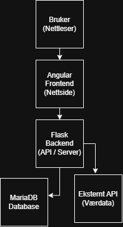

# Travel Planner

## Oversikt

Travel Planner er en webapplikasjon hvor brukere kan planlegge reiser.
Brukeren kan opprette en reise, legge inn reisemål, datoer og aktiviteter.
Systemet lagrer informasjonen i en database.

Prosjektet er laget som en del av en IT-oppgave og viser hvordan jeg kan jobbe med frontend, backend og database.

---

## Mål med prosjektet

Målet med prosjektet er å:

* la brukere planlegge reiser
* lagre reiser i en database
* vise en reiseplan dag for dag
* vise prisestimat

---

## Teknologier

**Frontend:**

* Angular
* HTML
* CSS

**Backend:**

* Python
* Flask

**Database:**

* MariaDB

---

## Funksjoner

* Opprette en reise
* Generere en reiseplan
* Lagre reiser i database
* Vise lagrede reiser

---

## Brukerveiledning (VIKTIG)

1. Åpne nettsiden
2. Skriv inn:

   * Destinasjon
   * Start- og sluttdato
   * Antall personer
   * Budsjett
3. Klikk på **"Generer reise"**
4. Du får:

   * En reiseplan dag for dag
   * Bilder
   * Prisestimat

### Se lagrede reiser

* Gå til siden **"Mine reiser"**
* Der vises alle lagrede turer

---

## Systemarkitektur

---

## Hva jeg har lært

* Hvordan koble frontend og backend
* Hvordan bruke API (HTTP)
* Hvordan lagre data i database
* Hvordan lage en fullstack applikasjon

---

## Laget av

Eya
